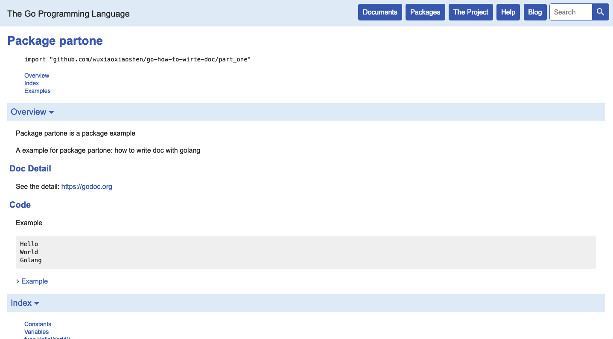

# How to write doc for golang package
[](https://travis-ci.com/wuxiaoxiaoshen/go-how-to-write-doc)


:fire::fire: 大纲

- go doc 的使用、 gometalinter 的使用 、go vet 的使用
- package 注释
- function 注释
- const 注释
- var 注释
- doc.go 文件


> 只对可导出的变量、常量、函数、方法可自动识别。意味着对这些进行注释，才可生成文档。


## go doc

本地查看文档

``` 
go doc -http=:9999

```

在线版：https://godoc.org/

## 注释说明

### Package 

即：doc.go 文件的语法

``` 
# doc.go

// Package Project is ...
// 
// 第一段标题
// 
// 第一段落内容
// 
// 第二段标题
//
// 第二段内容
//
// Example:
//  code line
//  code line
//  code line 缩进可以表示代码，或者代码块
// 
// See Also
// Link: https://godoc.org/ 自动将链接转化成超链接

```

### Const

``` 

// A couple of const name
const (
    Name string // name
    Version string // version
    
)
``` 

自动识别在文档的：Constants 段落下

### var 

``` 

var (
    Name string // name
    Version string // version
)
```

自动识别在文档的：Variables 段落下

### function 

``` 

// Name is a function
func Name() string{
    return "XieWei"
}

```

自动识别在文档的：func Name 段落下

原则是：在声明的上方进行注释说明。

### Example

即：对整个包或者某些可导出的函数在文档中显示示例。

``` 
// package project
// name.go

func Name()string{
    return "XieWei"
}
```

``` 
// package project
// name_test.go

func ExampleName() {
    project.Name()
}

```

在文档中的 Name 下，存在一个示例。


函数的示例以 ExampleX... 开头，X 代表的是函数的名称

Package 的示例以 Example 开头。


正确的使用方式：

下载：
``` 
go get github.com/wuxiaoxiaoshen/go-how-to-write-doc
```

运行：
``` 
go doc -http=:9999
```

访问：
``` 
http://127.0.0.1:9999/pkg/github.com/wuxiaoxiaoshen/go-how-to-wirte-doc/part_one/
```

随意更改包内的注释，查看本地文档的变化。

